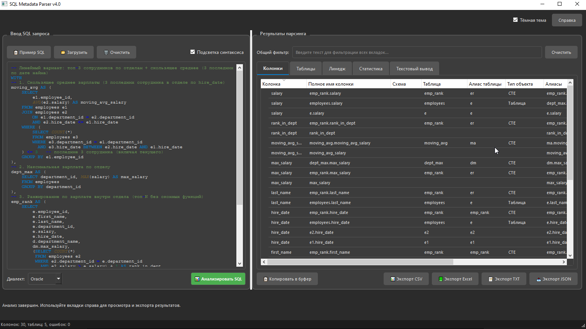
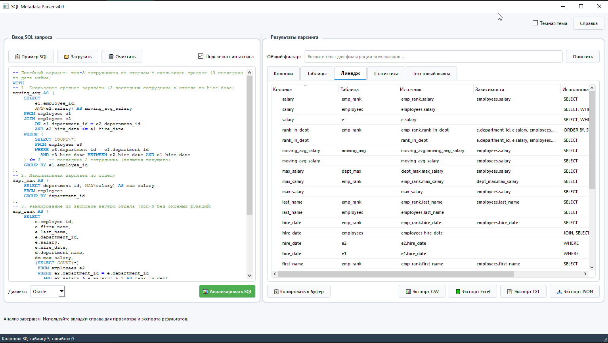

# SQL Metadata Parser v5.0

Инструмент для анализа SQL-запросов, извлечения метаданных таблиц и колонок с поддержкой различных диалектов SQL. Приложение предоставляет графический интерфейс на PyQt6 для удобной визуализации результатов.

markdown




## Возможности

- **Автоматический парсинг SQL-запросов** с использованием библиотеки sqlglot
- **Прогрессивный парсинг** — пошаговая очистка SQL с автоматическим исправлением ошибок
- **Поддержка диалектов SQL**: Oracle, PostgreSQL, MySQL, SQL Server, Snowflake, BigQuery, Clickhouse, DuckDB, и др.
- **Извлечение метаданных**:
  - Таблицы и их алиасы
  - Колонки с контекстом использования (SELECT, WHERE, JOIN, ORDER BY и т.д.)
  - Алиасы колонок и таблиц
  - Расчётные колонки (агрегации, выражения)
  - Линейные зависимости (lineage)
  - Типы таблиц (таблица, CTE, подзапрос, процедура)
  - Типы JOIN (LEFT, RIGHT, INNER, OUTER)
- **Мощный препроцессор SQL** (21 шаг очистки):
  - Удаление комментариев с учётом строковых литералов
  - Обработка Oracle hints, outer join (+), T-SQL GO, PL/SQL блоков
  - Замена XML-блоков `<Procedure>`, `TABLE()` функций, ODBC `{fn...}`
  - Конвертация CONVERT → CAST, @переменных, TO_DATE
  - Исправление незакрытых CASE, неполных BETWEEN, несбалансированных скобок
  - Конвертация IF() → CASE WHEN
- **Визуализация результатов** через древовидные виджеты и вкладки
- **Экспорт данных** в Excel (.xlsx) и JSON форматы
- **Подсветка синтаксиса SQL** в редакторе запросов
- **Загрузка SQL из файлов** и примеры запросов
- **Фильтрация и поиск** по результатам анализа

## Архитектура проекта

### Основные модули

1. **`app.py`** — точка входа приложения
2. **`core/sql_parser.py`** — фасад, экспортирует все классы парсера
3. **`core/sql_preprocessor.py`** — препроцессор SQL (21 шаг очистки):
   - Удаление комментариев, Oracle hints, outer join, T-SQL GO
   - Удаление PL/SQL блоков, замена `<Procedure>` XML, `TABLE()`, ODBC `{fn...}`
   - Конвертация CONVERT, @переменных, TO_DATE
   - Исправление CASE, BETWEEN, скобок, CTE, IF()
   - `preprocess_stepwise()` — генератор для пошаговой обработки
4. **`core/parser_strategy.py`** — стратегии парсинга:
   - `ParserStrategy` — абстрактный базовый класс
   - `SQLGlotParserStrategy` — парсинг через sqlglot с полной предобработкой
   - `ProgressiveSQLGlotParserStrategy` — пошаговый парсинг с автоисправлением ошибок
5. **`core/parser_factory.py`** — фабрика парсеров (`"sqlglot"`, `"progressive"`)
6. **`core/column_analyzer.py`** — детальный анализатор колонок:
   - O(1) поиск таблиц через `_table_name_index`
   - Быстрый поиск CTE через `_cte_names`
   - Обработка `catalog.schema` для полных имён схем
7. **`core/export_manager.py`** — менеджер экспорта данных:
   - `ExportStrategy` (абстрактный класс)
   - `ExcelExportStrategy`, `JSONExportStrategy` (конкретные реализации)
   - `ExportManager` (управление экспортом)
8. **`models/sql_metadata.py`** — модели данных:
   - `SQLMetadata` (контейнер метаданных с `procedures` и `table_functions`)
   - `TableInfo` (информация о таблице с `join_type`)
   - `ColumnMetadata` (информация о колонке)
   - `TableType` (enum: TABLE, SUBQUERY, CTE, VIEW, PROCEDURE, UNKNOWN)
9. **`ui/main_window.py`** — главное окно PyQt6, включает:
   - `MainWindow` (основной класс интерфейса)
   - `SQLHighlighter` (подсветка синтаксиса SQL, встроенный класс)
   - `ParseWorker` (рабочий поток для парсинга)
10. **`ui/help_text.py`** — текст справки приложения
11. **`tests/`** — модульные тесты


## Установка и запуск


### Требования

- Python 3.10+
- Зависимости указаны в `requirements.txt`

### Установка зависимостей

```bash
pip install -r requirements.txt
```

### Запуск приложения

```bash
python app.py
```

### Запуск тестов

```bash
pytest tests/
```

### Демонстрационный скрипт

```bash
python test_usage.py
```

## Использование

### Графический интерфейс

1. Запустите приложение `python app.py`
2. Введите SQL-запрос в левое текстовое поле
3. Выберите диалект SQL (по умолчанию Oracle)
4. Нажмите кнопку "Анализировать SQL"
5. Просмотрите результаты во вкладках справа:
   - **Таблицы** — список таблиц с алиасами, типами и типом JOIN
   - **Колонки** — детальная информация о колонках с контекстом использования
   - **Линейные зависимости** — связи между таблицами и колонками
   - **Статистика** — сводная информация о запросе
   - **Текстовый вывод** — форматированный текстовый отчёт
6. Экспортируйте результаты в Excel или JSON через меню "Экспорт"

### Программное использование

```python
from core.parser_factory import ParserFactory
from core.sql_dialect import SQLDialect

# Стандартный парсер (полная предобработка)
parser = ParserFactory.create_parser("sqlglot", dialect=SQLDialect.ORACLE)
metadata = parser.parse("SELECT a, b FROM users WHERE id = 1")

# Прогрессивный парсер (пошаговая очистка, автоисправление ошибок)
parser = ParserFactory.create_parser("progressive", dialect=SQLDialect.ORACLE)
metadata = parser.parse("SELECT a FROM (SELECT b FROM t1")  # незакрытая скобка — исправится автоматически

print(f"Колонки: {len(metadata.columns)}")
print(f"Таблицы: {len(metadata.tables)}")
print(f"Ошибки: {metadata.parse_errors}")
print(f"Применённые шаги: {parser.last_applied_steps}")
```

## Примеры SQL-запросов

В приложении доступны примеры сложных запросов через меню "Примеры":
- Запрос с JOIN, подзапросами и CTE
- Запрос с оконными функциями и агрегациями
- Запрос с расчётными колонками и алиасами
- Запрос с незакрытыми скобками и CASE (автоисправление)

## Тестирование

Проект включает модульные тесты для ключевых компонентов:

- `tests/test_sql_preprocessor.py` — тесты препроцессора SQL (5 тестов)
- `tests/test_column_analysis.py` — тесты анализа колонок (5 тестов)
- `tests/test_join_type_feature.py` — тесты извлечения типа JOIN (6 тестов)
- `tests/test_progressive_parser.py` — тесты прогрессивного парсера (12 тестов)

**Итого: 28 тестов**

Запуск всех тестов:

```bash
pytest tests/ -v
```

## Изменения (ChangeLog)

Подробное описание всех изменений см. в [ChangeLog.md](ChangeLog.md).

### Ключевые изменения v5.0 (июль 2026)

1. **Прогрессивный парсер** — пошаговая очистка SQL с автоисправлением ошибок
2. **21 шаг препроцессинга** — удаление комментариев, Oracle hints, outer join, PL/SQL, замена CONVERT, ODBC, @переменных, исправление CASE, BETWEEN, скобок
3. **O(1) поиск таблиц** — индексация через `_table_name_index` и `_cte_names`
4. **Типы JOIN** — LEFT, RIGHT, INNER, OUTER, Oracle outer join (+)
5. **Procedure и TABLE()** — обработка SAP BO XML-блоков и TABLE() функций
6. **Устранение дублирования** — метод `resolve_table_info()` в SQLMetadata
7. **Логирование ошибок** — все стратегии экспорта логируют ошибки
8. **pyproject.toml** — конфигурация pytest, ruff, setuptools

## Сборка исполняемого файла (EXE)

Проект включает средства для создания автономного исполняемого файла (EXE) с помощью PyInstaller. Все файлы, необходимые для сборки, находятся в папке `for_exe`.

### Структура папки `for_exe`

- `build_exe.bat` — скрипт для автоматической сборки EXE (Windows)
- `SQLparser_hook.spec` — конфигурационный файл PyInstaller с настройками хуков
- `hook-PyQt6.py` — хук для корректного включения PyQt6
- `hook-sqlglot.py` — хук для включения sqlglot

### Сборка EXE (Windows)

1. Убедитесь, что установлен Python 3.8+ и добавлен в PATH.
2. Перейдите в папку `for_exe`:
   ```bash
   cd for_exe
   ```
3. Запустите скрипт сборки:
   ```bash
   build_exe.bat
   ```
   Скрипт автоматически:
   - Создаст виртуальное окружение (если отсутствует)
   - Установит все зависимости (PyInstaller, sqlglot, pandas, openpyxl, PyQt6)
   - Выполнит сборку с использованием spec-файла
   - Скопирует готовый `SQLparser.exe` в корень проекта

4. После успешной сборки исполняемый файл будет находиться в корне проекта (`../SQLparser.exe`).

### Ручная сборка с PyInstaller

Если требуется ручная сборка, выполните команду из папки `for_exe`:
```bash
pyinstaller --clean --log-level INFO SQLparser_hook.spec
```

### Примечания

- Сборка использует исправленный хук для PyQt6, чтобы избежать ошибки PEFormatError.
- Размер итогового EXE-файла составляет около 140–150 МБ.
- Собранное приложение является консольным (окно консоли отображается при запуске). Для скрытия консоли измените параметр `console=True` на `console=False` в spec-файле.

## Разработчик

- **Автор**: @BDV_80 (Береговой Дмитрий)
- **Версия**: 5.0 (PyQt6)
- **Лицензия**: MIT

## Благодарности

- Библиотека [sqlglot](https://github.com/tobymao/sqlglot) за мощный парсинг SQL
- [PyQt6](https://www.riverbankcomputing.com/software/pyqt/) за фреймворк GUI
- [pandas](https://pandas.pydata.org/) за обработку данных и экспорт в Excel