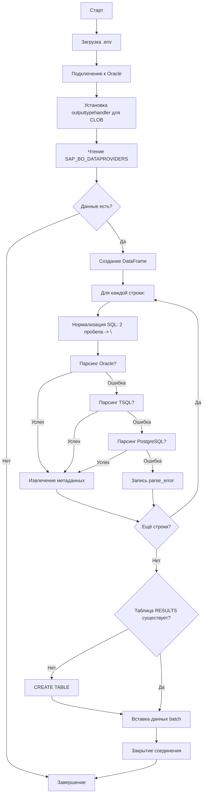

# План создания скрипта `powerbi_export.py`

## 1. Цель

Создать полностью автономный Python-скрипт `powerbi_export.py`, который:
- Подключается к Oracle БД через `cx_Oracle`
- Читает SQL-запросы из таблицы `SAP_BO_DATAPROVIDERS` (поле `SQL_TEXT` типа CLOB)
- Нормализует SQL: если запрос записан одной строкой с двойными пробелами-разделителями — заменяет `  ` на `\n`
- Пытается распарсить SQL последовательно: **Oracle → TSQL → PostgreSQL**
- Записывает результат парсинга в таблицу `SAP_BO_SQL_PARSE_RESULTS`
- Формирует составной ключ `KEY` из `REP_ID` + `DP_ID` для связи с исходной таблицей
- **Не дублирует** `SQL_TEXT` в таблице результатов (только ключ для связи)

## 2. Структура скрипта

```
powerbi_export.py  (один файл, ~600-800 строк)
```

## 3. Детальные шаги реализации

### 3.1. Импорты и конфигурация
- Стандартные: `os`, `sys`, `json`, `re`, `datetime`
- БД: `cx_Oracle`
- Парсинг: `sqlglot` (`parse_one`, `exp`)
- DataFrame: `pandas`
- Переменные окружения: `dotenv`

### 3.2. Загрузка переменных окружения
- Файл `.env` (например, `prod_env.env`)
- Переменные:
  - `DB_USER`, `DB_PASS`, `DB_DSN`
  - `PROVIDERS_TABLE` (по умолчанию `SAP_BO_DATAPROVIDERS`)
  - `RESULTS_TABLE` (по умолчанию `SAP_BO_SQL_PARSE_RESULTS`)

### 3.3. Нормализация SQL перед парсингом

Функция `normalize_sql_for_parsing(sql: str) -> str`:

**Проблема:** SQL-запросы в БД записаны одной строкой, где разделителем между элементами служат двойные пробелы. Например:
```
select  t,  t2,  t4  from  tt  where  t.id = 1
```

sqlglot может некорректно парсить такие однострочные запросы.

**Решение:** Если в SQL встречаются двойные пробелы — заменяем каждый `  ` (два пробела) на `\n` (перенос строки):
```
select
t,
t2,
t4
from tt
where t.id = 1
```

**Алгоритм:**
1. Замена `\r\n` → `\n` (унификация окончаний строк)
2. Если SQL НЕ содержит `\n` (одна строка) И содержит `  ` (двойные пробелы):
   - Замена `  ` (два пробела) → `\n`
3. Удаление лишних пробелов в начале/конце каждой строки
4. Схлопывание множественных `\n` в один
5. `strip()`

### 3.4. Автоопределение диалекта

Функция `parse_sql_with_dialect_auto(sql: str, dialects: list) -> tuple[AST | None, str | None]`:
1. Пробуем `sqlglot.parse_one(sql, dialect='oracle')`
2. Если ошибка → пробуем `sqlglot.parse_one(sql, dialect='tsql')`
3. Если ошибка → пробуем `sqlglot.parse_one(sql, dialect='postgres')`
4. Если все диалекты не подошли → возвращаем `(None, None)`
5. Если успех → возвращаем `(ast, dialect_name)`

Порядок перебора: `['oracle', 'tsql', 'postgres']`

### 3.5. Копирование классов из `core/` и `models/`

Перенести следующие классы (с минимальными изменениями):

| Исходный файл | Класс/функция |
|---|---|
| `core/sql_dialect.py` | `SQLDialect` (enum), `dialect_to_sqlglot()` |
| `core/sql_preprocessor.py` | `SQLPreprocessor` |
| `core/parser_strategy.py` | `ParserStrategy` (ABC), `SQLGlotParserStrategy` |
| `core/column_analyzer.py` | `DetailedColumnAnalyzer`, `ScopeInfo`, `CALCULATION_NODES` |
| `core/parser_factory.py` | `ParserFactory` |
| `models/sql_metadata.py` | `TableType` (enum), `ColumnMetadata`, `TableInfo`, `SQLMetadata` |

**Изменения в `SQLGlotParserStrategy`:**
- Добавить поддержку автоопределения диалекта
- Если диалект не указан явно — использовать `parse_sql_with_dialect_auto()`

### 3.6. Функция `process_dataframe_v2` (исправленная)

**Ключевые исправления:**
- Параметр `sql_column` по умолчанию `'SQL_TEXT'` (а не `'SQL'`)
- Перед парсингом вызывать `normalize_sql_for_parsing()`
- Использовать автоопределение диалекта
- Корректная обработка CLOB через `outputtypehandler`
- Формирование составного ключа `KEY = REP_ID + '_' + DP_ID`

**Логика:**
1. Для каждой строки DataFrame читаем SQL из колонки `sql_column`
2. Если SQL пустой или не строка — пропускаем
3. Нормализуем SQL (замена двойных пробелов на переносы строк)
4. Парсим с автоопределением диалекта
5. Извлекаем колонки и таблицы из `SQLMetadata`
6. Формируем плоский список записей для вставки

### 3.7. Формат выходных данных

Каждая запись содержит:

| Колонка | Тип Oracle | Описание |
|---|---|---|
| `LOAD_DATE` | TIMESTAMP | Дата загрузки |
| `KEY` | VARCHAR2(200) | Составной ключ `REP_ID_DP_ID` для связи с провайдерами |
| `REP_ID` | NUMBER | ID отчета |
| `DP_ID` | VARCHAR2(100) | ID датапровайдера |
| `COL_NAME` | VARCHAR2(1000) | Имя колонки |
| `TABLE_SCHEMA` | VARCHAR2(1000) | Схема таблицы |
| `TABLE_NAME` | VARCHAR2(1000) | Имя таблицы |
| `TABLE_TYPE` | VARCHAR2(100) | Тип таблицы (Таблица/Подзапрос/CTE/parse_error) |
| `TABLE_ALIAS` | VARCHAR2(1000) | Алиас таблицы |
| `COL_FULL_NAME` | VARCHAR2(2000) | Полное имя колонки |
| `DIALECT` | VARCHAR2(50) | Диалект SQL, которым удалось распарсить |

**Важно:** `SQL_TEXT` не записывается в таблицу результатов. Для связи используется составной ключ `KEY`.

### 3.8. Работа с Oracle

1. **Подключение** через `cx_Oracle.connect()`
2. **Обработчик CLOB** (для чтения длинных CLOB):
   ```python
   def output_type_handler(cursor, name, default_type, size, precision, scale):
       if default_type == cx_Oracle.CLOB:
           return cursor.var(cx_Oracle.LONG_STRING, arraysize=cursor.arraysize)
       return cursor.var(default_type, size, cursor.arraysize)
   cursor.outputtypehandler = output_type_handler
   ```
3. **Чтение данных**:
   ```sql
   SELECT REP_ID, DP_ID, SQL_TEXT 
   FROM {PROVIDERS_TABLE}
   WHERE SQL_TEXT IS NOT NULL
   ```
4. **Проверка существования** таблицы результатов через `user_tables`
5. **CREATE TABLE** если не существует
6. **Вставка данных** пачками по 100 записей через `cursor.executemany()`
7. `connection.commit()` после каждой пачки

### 3.9. Обработка ошибок

- Если парсинг SQL не удался ни одним диалектом — запись с `TABLE_TYPE = 'parse_error'` и `COL_NAME = 'ERROR'`
- Ошибки БД — rollback и вывод в `stderr`
- Общие исключения — `traceback.print_exc()`

## 4. Схема работы скрипта



## 5. Зависимости

В скрипте используются библиотеки (должны быть установлены):
```
cx_Oracle>=8.3.0
python-dotenv>=1.0.0
sqlglot>=28.6.0
pandas>=2.0.0
```

## 6. Файл .env (пример)

```ini
DB_USER=your_user
DB_PASS=your_password
DB_DSN=your_host:1521/your_service
PROVIDERS_TABLE=SAP_BO_DATAPROVIDERS
RESULTS_TABLE=SAP_BO_SQL_PARSE_RESULTS
```

## 7. Файлы для создания

| Файл | Действие |
|---|---|
| `powerbi_export.py` | Создать (автономный скрипт) |
| `prod_env.env` | Создать (пример, если нет) |